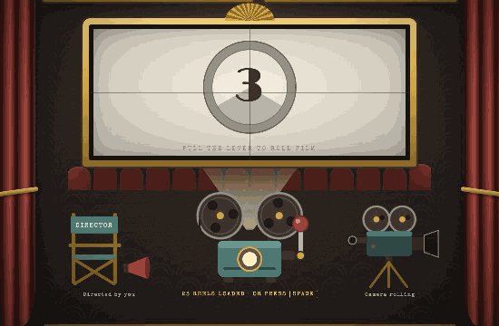

# Case study: Reel Picks

**One line:** a one-screen web app that turns "what do we watch tonight?" into a three-second,
slightly theatrical ritual: pick your services and a mood, pull a lever, get one movie.

**Live:** https://ashwynkmr.github.io/reel-picks/ · **Code and history:** this repository

---

## 1. The problem

Households pay for several streaming services, but every app only shows its own library and is
designed to keep you browsing. Aggregators solve _where is it streaming_ but hand you another long
list. The failure isn't a lack of options; it's too many options, split across apps, at the moment
you're least willing to choose.

**Job to be done:** _when I can't decide, help me commit to a good movie I already have access to,
fast, so I can stop choosing and start watching._

Personas, competitor gaps and the riskiest assumptions are in
[problem and opportunity](product/problem-and-opportunity.md). They're labelled as hypotheses: no
user research was run for this project, and each assumption has a cheap test attached.

## 2. The bet

| Principle                 | In the product                                                        |
| ------------------------- | --------------------------------------------------------------------- |
| One answer, not a list    | The reel lands on a single film. Want another? Pull again.            |
| Enough to say yes in 10 s | IMDb rating, a two-line synopsis, a trailer. Nothing else.            |
| Make choosing fun         | The spin _is_ the product: a small dopamine hit instead of a chore.   |
| Honest about limits       | Availability is a dated snapshot, and the app says so in the credits. |

## 3. How it was run

Five phases, each ending in a gate, a pull request with product notes, a tagged release and a
changelog entry:

| Phase | Shipped                                              | Gate                                    |
| ----- | ---------------------------------------------------- | --------------------------------------- |
| 0     | Scaffold, CI/CD, curated catalogue + validator, docs | Every record valid; coverage reviewed   |
| 1     | Working picker, deliberately unstyled                | Works end to end                        |
| 2     | The 80s movie-palace look                            | Design signed off (after one rejection) |
| 3     | The spin, clapperboard and card landing              | Feels right on phone and laptop         |
| 4     | Sound, 154 films, share preview, audits              | Lighthouse accessibility ≥ 95           |

Function first, then look, then motion: each layer landed on something that already worked, so
design and animation never had to be debugged at the same time as logic.

## 4. Decisions that mattered

Eleven are recorded in the [decision log](decisions/README.md). The ones with the most product weight:

- **A curated catalogue instead of a live API** ([0001](decisions/0001-static-curated-catalogue.md)).
  No backend or keys, and every film is one worth recommending, which matters more for a
  single-pick product than breadth. Cost: availability drifts, so the snapshot date is shown and
  there's a one-click correction form.
- **Prefer films each platform owns** ([0005](decisions/0005-prefer-owned-titles.md)). Netflix
  originals stay on Netflix; Warner films stay on HBO Max. The snapshot stays true far longer, at
  the cost of balance.
- **Randomness that feels random** ([0006](decisions/0006-avoid-recent-repeats.md)). True randomness
  repeats often enough to feel broken, so the last five picks are held back.
- **Empty states that fix themselves** ([0007](decisions/0007-empty-states-offer-a-fix.md)).
  "Netflix has no classics" comes with **Add HBO Max** and **Try any genre** buttons, not a dead end.
- **Put the answer where films go** ([0008](decisions/0008-reveal-on-the-screen.md)). The result
  appears on the silver screen, not in a modal, so the lever and filters stay in reach for the
  next pull.
- **A 3-second reveal, always skippable** ([0010](decisions/0010-motion-without-a-library.md)).
  Long enough for anticipation, short enough to stay inside the 10-second goal; Skip, the lever or
  Space cuts straight to the card, and reduced-motion users get it instantly.

## 5. Things the process caught

The most useful moments were the ones where a check disagreed with a plan:

- **A structural market gap, not a data bug.** The catalogue validator prints a platform × genre
  grid. It showed Netflix and Apple TV have almost no classics, because they own almost no back
  catalogue. That changed the empty-state design rather than the data.
- **Design rejected, then reframed.** The first mockup was a themed form and was rejected as
  "bland, not fun and classy yet." The diagnosis was that it decorated the controls but not the
  space. The fix was a concept, not more ornaments: the whole page became the theatre.
  ([design notes](design/README.md))
- **A stale answer on screen.** While testing Phase 2, a card picked under old filters could sit
  beside new counts and a jammed lever. Rule adopted: changing the question clears the answer.
- **Accessibility bugs automated tests found.** Screen readers heard "Classics1 reel"; faded
  tickets failed contrast. Both fixed, and axe-core now runs on every screen state in CI.
- **A blank production preview.** Lighthouse reported "no paint"; the cause was a build-path
  setting that only broke local previews of the production build. Fixed before launch.

## 6. Results

- Shipped v1.0 in five phases, each through CI and a reviewed pull request.
- 154 hand-picked films across Netflix, Prime Video, HBO Max, Disney+, Hulu and Apple TV.
- Lighthouse on the production build: **mobile 97 performance / 100 accessibility / 100 best
  practices / 100 SEO; desktop 100 across the board.**
- 50 automated tests (logic, full user flows, the reveal timing, accessibility audits).
- Zero third-party requests: fonts self-hosted, no analytics, sounds synthesized in code.

## 7. What I'd measure next

No analytics shipped, by choice. With privacy-friendly counters, in priority order:

1. **Time from load to first card** (goal < 10 s): the core promise.
2. **Spins per session** (healthy: 1-3): too many means picks aren't landing.
3. **Trailer click-through from the card** (> 35%): a proxy for "this pick was interesting."
4. **Empty-state rate** (< 2% of pulls): catalogue gaps users actually hit.
5. **Mute rate:** whether sound on by default is the right call.

## 8. What's next

| Idea                                                  | Why                                                     |
| ----------------------------------------------------- | ------------------------------------------------------- |
| Scheduled job that checks availability and opens a PR | Keeps the snapshot honest without losing human curation |
| Verified trailer and IMDb ids                         | Removes the extra click through search results          |
| "Watched it / not for me" on the card                 | First real signal of pick quality; smarter holds        |
| Share a pick as a link                                | The couch negotiator sends it to the other person       |
| More than one mood at a time                          | Only if people ask for it; it dilutes "one answer"      |

## 9. How it was built

Product direction, scope, design review and every decision above were mine. Implementation was
pair-programmed with Claude Code (Anthropic's AI coding agent), which is credited as co-author on
the commits. The PRD, decision log, pull requests and changelog show how each call was made.
